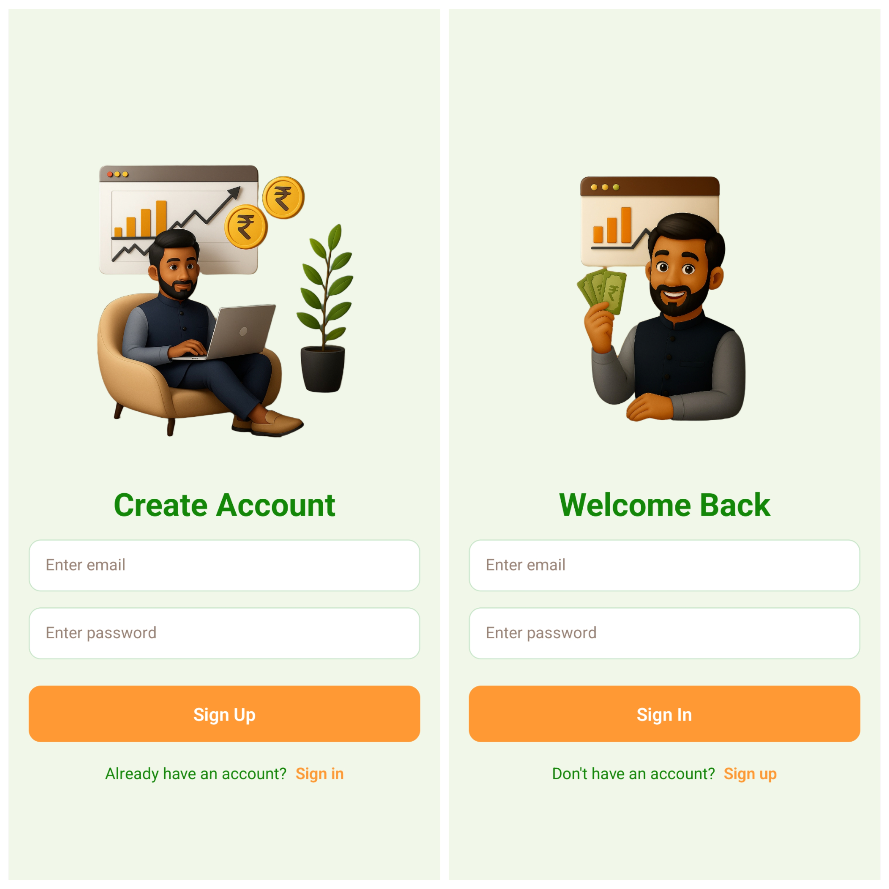

<h1 align="center">
  <br>
  💰 Expense Tracker App (RN-MERN) 💸
  <br>
</h1>

<div align="center">
  
</div>

<p align="center">
  A cross-platform expense tracker app built with React Native (Expo) and Node.js. Track income & expenses in real time!
</p>

<div align="center">

| Authentication Pages                                                                                | Transaction Pages                                                                                                   |
| --------------------------------------------------------------------------------------------------- | ------------------------------------------------------------------------------------------------------------------- |
|  |  |

</div>

## ✨ Features

- 🔐 **User Authentication**: Signup and login using Clerk authentication
- 📧 **Email Verification**: Secure 6-digit verification code before accessing the app
- 📱 **5 Screens**: Signup, Login, Verify Email, Home, and Create Transaction
- 💰 **Expense Tracker**: Add income or expenses and manage financial entries
- ⚡ **Live Balance Updates**: Current balance calculated dynamically
- 🗑️ **Delete Transactions**: Remove old entries with a single tap
- 🔄 **Pull-to-Refresh**: Classic refresh gesture implemented from scratch
- 👋 **Logout**: Easily switch accounts or sign out
- 🛡️ **Rate Limiting**: Redis-based protection for API endpoints
- 🚀 **Backend**: Express RESTful API connected to MongoDB


## 🛠️ Tech Stack

- **Frontend**: React Native, Expo
- **Backend**: Node.js with Express – RESTful API
- **Database**: MongoDB with Mongoose
- **Caching & Rate Limiting**: Redis
- **Authentication**: Clerk


## ⚙️ Installation & Setup

### Prerequisites

- Node.js (v18 or higher)
- npm or yarn
- MongoDB database (e.g., MongoDB Atlas)
- Redis server (e.g., Upstash Redis)

### Setup

1. **Clone the repository**

   ```bash
   git clone https://github.com/soumadip-dev/ExpenseTracker-RN-PERN.git
   cd ExpenseTracker-RN-PERN
   ```

2. **Backend Setup**

   ```bash
   cd server
   npm install
   ```

   Create a `.env` file in the `server` directory with:

   ```env
   PORT=8080
   MONGO_URI=<your_mongodb_uri>
   UPSTASH_REDIS_REST_URL=<your_upstash_redis_rest_url>
   UPSTASH_REDIS_REST_TOKEN=<your_upstash_redis_rest_token>
   ```

3. **Frontend Setup**

   ```bash
   cd ../mobile
   npm install
   ```

   Create a `.env` file in the `mobile` directory with:

   ```env
   EXPO_PUBLIC_CLERK_PUBLISHABLE_KEY=<your_clerk_publishable_key>
   ```

4. **Run the Application**

   - Backend (Terminal 1):
     ```bash
     cd server
     npm run dev
     ```
   - Frontend (Terminal 2):
     ```bash
     cd ../mobile
     npm start
     ```
